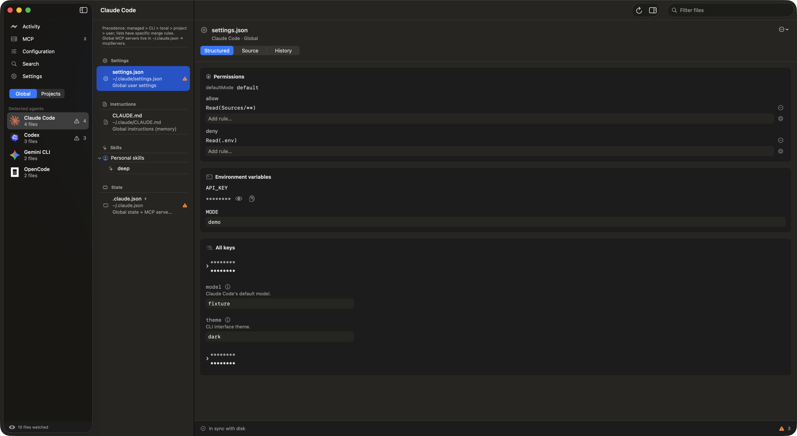

# AgentsConfig

A native macOS app (SwiftUI) to inspect, edit and audit the global
configuration of your AI coding agents — Claude Code, Codex,
Gemini CLI, Antigravity and OpenCode — from one place, with read-only
inventory adapters for Cursor and GitHub Copilot CLI.

> **Status: experimental.** The app is usable, but treat its editing
> features with care: always review diffs and keep your own backups of
> critical configs.



Captured with an isolated demo home and preferences. More
[screenshots](docs/redesign/README.md) show editing, history and settings.

AgentsConfig runs locally and does not require a model, AI subscription or API key of its own. It inspects configuration; it does not run configured MCP servers or hooks. This is an independent project, not endorsed by supported agent vendors.

## What it does

- **Detects installed agents** and their global config files via a
  declarative registry — adding support for a new agent is one entry in
  `AgentRegistry.swift`.
- **Inspects local per-repository config**: register a project folder and
  its `.claude/`, `.codex/`, `.gemini/`, `AGENTS.md`/`opencode.json`, etc.
  get the same watching, diffing, history and secrets masking as global
  files. Also detects git submodules (via `.gitmodules`) and inspects their
  own local config. The sidebar's Global/Projects switcher keeps the two
  scopes from piling up in one long list: pick a project from a menu, then
  a scope chip for its root or a submodule. Local MCP servers show up in
  the cross-agent comparator, read-only.
- **Watches files live** (`DispatchSource` vnode watchers, debounced,
  resilient to atomic saves) and flags external changes with banners.
- **Semantic diffs** on every change: key-path level for
  JSON/JSONC/TOML, line diff as fallback.
- **Versioned history** per file, stored locally, with revert and
  arbitrary version-to-version comparison.
- **Structured editing** for JSON/JSONC (MCP servers,
  permissions, env vars, plugins…) on top of a syntax-highlighted
  source editor with find bar. TOML uses Source editing; MCP add/copy uses
  a separate reviewed operation preserving unrelated TOML types.
- **Cross-agent MCP comparator**: a table of every configured MCP
  server × agent, with copy-to-agent to sync specs across tools.
- **Secrets masking**: API keys and tokens render masked in the
  structured and read-only views.
- **Security diagnostics**: flags broad permissions, approval bypasses,
  risky hooks, unpinned MCP packages and literal secrets. Rules can be
  muted per file; these static checks do not execute commands.
- **In-app docs**: explains what each file and each known setting does,
  with links to the official documentation — the same explanations apply
  whether the file is global or a per-project copy.
- **Rendered Markdown preview** for instruction files (CLAUDE.md, AGENTS.md…):
  real headings, lists, code blocks and quotes, not raw source.
- **Native per-destination navigation**: three columns for files and
  Activity, two full-width columns for Settings and the MCP comparator.
  The inspector adapts to available width — a side panel or a compact
  sheet — and History switches between a compact version picker and a
  side-by-side list as the window resizes.
- Activity feed, macOS notifications on external changes, menu bar
  extra, inspector panel, light/dark mode, English/Spanish UI switchable
  live. Settings are reachable both as a native macOS window (⌘,) and as
  an in-app sidebar destination.

## Configuration analysis

The **Configuration** destination explains the on-disk configuration for a
selected agent, project, working folder and optional Codex profile. Each value
shows its source, superseded values, trust conditions and supported managed
restrictions. Version and trust controls are analysis assumptions; they never
change client settings or grant permissions. Unobserved CLI/environment,
remote policies and unsupported field-specific rules remain explicit.

The **Instructions** and **Skills** tabs show instruction candidates and overrides,
YAML metadata, shared consumers, resources, import cycles and traversal limits.
Skills are grouped by origin (personal, project, plugins, system) and, when an
origin has more than one owner, by skills folder or plugin package — the same
rule as the Files list. Resource previews are read-only and never execute scripts.
Candidate status does not confirm that a session loaded the content. Custom roots
can be selected in Settings; terminal environment variables are not inferred from
another process.

The **MCP** comparator filters by project or profile and explains shadowed,
disabled and ambiguous definitions. Its semantic comparison keeps argument order
and redacts credentials. It does not connect to servers or validate login state.

**Diagnostics** exports a reviewed, fixed snapshot as JSON or Markdown. Default
exports anonymize sources and omit setting values/free-form diagnostic details.
Nothing is uploaded. **Search** searches redacted loaded content across agents and
projects, up to 2 MB per file and 100 results.

See [implementation and verification](docs/audits/ALL-PRIORITIES.md) for the current
scope, tested behaviors and verification evidence.

## Privacy & data handling

Everything happens locally. The app reads and writes your agent config
files (`~/.claude/`, `~/.codex/`, etc.) and keeps snapshots under
`~/Library/Application Support/AgentsConfig/History/`. No telemetry,
no network calls.

- **History is not encrypted.** Snapshots keep full file content —
  including any secrets inside them — in files with `0600` permissions
  inside `0700` directories. Files flagged `excludeFromHistory` in the
  registry (e.g. `~/.gemini/config/config.json`) and volatile state files are
  never snapshotted. Settings can disable new snapshots and save backups
  globally; the History tab also allows per-file opt-out. Existing history
  is retained. Individual versions or all indexed versions for one file can
  be removed with confirmation; concurrent new versions invalidate that review.
  Physical cleanup errors are visible and retriable. Legacy backups are retained. Purging is a deliberate manual
  deletion of the `History` folder after reviewing what you need to keep.
  Retention removes older versions; a save temporarily keeps at least two
  versions, and a restore with unsaved edits keeps at least three. Later
  operations resume the configured retention limit.
- **Masking is visual only.** Secret values are hidden in structured
  views, diffs, the activity feed and read-only source views, but the
  editable Source tab shows the real text and saved files are never
  rewritten with masks. The policy uses ancestor keys, arguments, headers
  and recognizable URL/command credentials. Diffs are always redacted,
  even when the display preference is off. Read-only JSON/JSONC/TOML
  previews are normalized; invalid structured input is hidden conservatively.
  Detection in arbitrary free text is heuristic, not universal.
- **Symlinks write through.** Valid relative/absolute links and link chains
  resolve to their target before saving. Linked parent directories support
  new files. Dangling links, cycles and unresolved parents are rejected
  without replacing the link. Resolution and replacement are separate
  operations; concurrent changes to links or directories are not atomic.
- **Concurrency.** AgentsConfig is a single-instance app; its history
  indexes are locked per file for concurrent access. Saves verify the
  live disk state before writing and back it up first, but the
  check-then-replace window is not a compare-and-swap against other
  writers. An external change after the backup and before replacement may
  be lost; that race is not recovered by the earlier backup.

## Supported scope

Every UI save, including Retry and Keep mine, requires a redacted review and
confirmation tied to the exact disk and buffer state. Restore also has a
pinned review. Large-file reviews show sizes and an explicit detailed-diff
omission notice; inspect Source before confirming. MCP adds/copies/replacements
first review the editor change, then use the same confirmed Save workflow. Unsupported cross-client fields (including timeouts
with different meanings, authentication and expansion syntax) block the copy.
Destinations and source references are in [MCP-SCHEMAS.md](docs/repair-plan/MCP-SCHEMAS.md).
Automatic edits in the Antigravity/Gemini group target **Gemini CLI** only.

Files up to 2,000,000 bytes retain structured inspection. Files between 2 MB
and 16 MB use background reading, validation and saving, with paginated Source
editing. Each page is around 65,536 UTF-16 units, expands to whole characters,
and has its own undo stack and Find scope. Oversized page pastes are rejected
with feedback. The complete buffer is validated and saved; other pages remain
intact. Large files are omitted from structured inspection and the MCP index.
Files over 16 MB still require an external editor. Large line diffs (over 2,000 lines per side) show an
omission notice. Semantic output is capped at 500 changes. Skills are
scanned/watched up to eight directory levels and 1,000 directories, with a
10,000-entry per-directory scan cap; directory symlinks and `.git` are skipped.

Legacy history is migrated under a per-file lock. Original directories are
renamed with `.migrated` only after a valid new index is published. To use an
older app again, keep backups and restore the original directory name manually
only when that destination is absent; older code does not automatically find
the renamed directory. Ambiguous or corrupt history stays visible as an error.

## Requirements

- macOS 15 or later
- Xcode with Swift 6 toolchain (verified with Xcode 26.1.1)
- [XcodeGen](https://github.com/yonaskolb/XcodeGen) (verified with 2.46.0;
  previous verification used 2.45.4)

## Build & run

```bash
git clone https://github.com/tavodev/agentsconfig.git
cd agentsconfig
xcodegen generate            # regenerate the .xcodeproj after adding/removing files in Sources/
xcodebuild -project AgentsConfig.xcodeproj -scheme AgentsConfig \
  -configuration Debug -destination 'platform=macOS' \
  -onlyUsePackageVersionsFromResolvedFile build
open ~/Library/Developer/Xcode/DerivedData/AgentsConfig-*/Build/Products/Debug/AgentsConfig.app
```

The app uses ad-hoc signing (`CODE_SIGN_IDENTITY = "-"`), intended to run
on the machine that compiled it. Signed/notarized distribution builds
follow a separate [release procedure](docs/RELEASING.md).

### Running against a sandboxed home

Point `AGENTSCONFIG_HOME` at any directory to make the app treat it as
`~` — agent detection, file watching and history all stay inside it.
Useful for demos and screenshots without touching real configs:

```bash
AGENTSCONFIG_HOME=/tmp/demo-home \
  ~/Library/Developer/Xcode/DerivedData/AgentsConfig-*/Build/Products/Debug/AgentsConfig.app/Contents/MacOS/AgentsConfig
```

`AGENTSCONFIG_HOME` alone redirects paths only. For isolated UI verification,
run `python3 scripts/run-demo.py --app /absolute/path/AgentsConfig.app`.
It creates fictitious configs and sets both `AGENTSCONFIG_HOME` and a unique
`AGENTSCONFIG_DEFAULTS_SUITE`; the app then disables its notification service
and uses that suite for all preferences. It prints the temporary directory
and process ID. No MCP command or hook is executed.

## Tests

```bash
xcodegen generate
xcodebuild -project AgentsConfig.xcodeproj -scheme AgentsConfig \
  -configuration Debug -destination 'platform=macOS' \
  -onlyUsePackageVersionsFromResolvedFile test
```

The suite runs entirely inside per-test temporary homes with fictitious
agents and fake secrets (`sk-test-FAKE-…`) — it never touches real
configs, never posts real notifications, and never launches the app.
All suites share one serialized parent so async tests cannot overlap those
process-global seams. The tests include AppKit coordinator checks; they do
not claim live end-to-end UI coverage. See [verification evidence](docs/repair-plan/VERIFICATION.md).

For real multiprocess history locking/migration, run
`python3 scripts/verify-history-processes.py`. It compiles the production
storage code into a temporary probe and checks four writers plus a legacy
baseline without touching real history.

### Opt-in UI regression tests

The separate `AgentsConfigUI` scheme contains 29 XCUITest scenarios using
fictitious homes, isolated preference suites and disabled notifications. Its
`AgentsConfigUITestHost` has a distinct bundle identifier so it cannot terminate
your normal app; the host refuses to start without the isolated environment.
The ordinary `AgentsConfig` test scheme never launches the app. Verification
runs locally; GitHub Actions is disabled and no hosted CI is configured.

```bash
xcodebuild -project AgentsConfig.xcodeproj -scheme AgentsConfigUI \
  -configuration Debug -destination 'platform=macOS' \
  -disableAutomaticPackageResolution build-for-testing
# Run only with an unlocked macOS graphical session:
xcodebuild -project AgentsConfig.xcodeproj -scheme AgentsConfigUI \
  -configuration Debug -destination 'platform=macOS' \
  -disableAutomaticPackageResolution test
```

See [release readiness](docs/RELEASE_READINESS.md) for the current results.
The historical [improvement record](docs/repair-plan/IMPROVEMENTS.md) preserves
earlier verification and limitations.

## Development

See [CONTRIBUTING.md](CONTRIBUTING.md) for contribution and AI-assistance policies,
[AGENTS.md](AGENTS.md) for architecture, and [CHANGELOG.md](CHANGELOG.md) for changes.
Release preparation is tracked in [RELEASE_READINESS.md](docs/RELEASE_READINESS.md).

This project is developed with the assistance of AI coding agents —
fitting, since it is a tool for auditing their configuration.
Contributions (human or AI-assisted) are welcome; whoever opens a pull
request is responsible for reviewing and understanding the code they
submit.

## Third-party licenses

Bundled dependencies and their licenses are listed in
[THIRD_PARTY_LICENSES.md](THIRD_PARTY_LICENSES.md).

## License

[MIT](LICENSE) © 2026 tavodev
